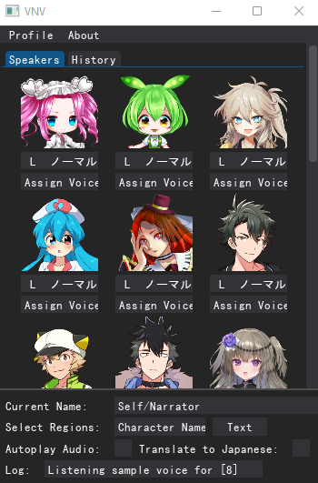
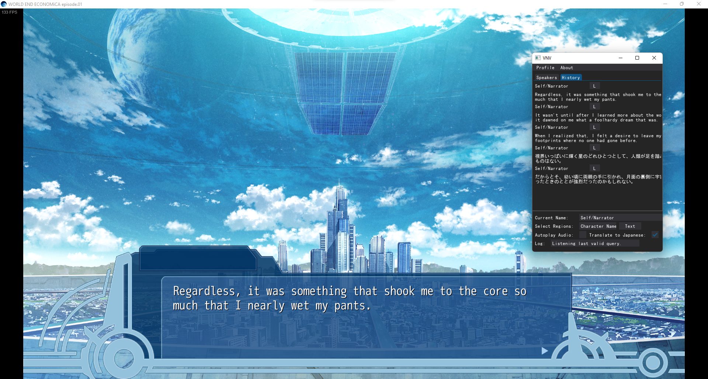

# visual-novel-voicer

The goal behind the creation of this project is to have voice support for visual novels that do not inherently have them. Although the program can do what it is designed to do on most cases, this is just a food for thought which still needs to be improved greatly. Which is why I have made this project public so people can create their own variations and upgrades and better this one. 
Whilst making this project I had some encounters which really frustrated me hence reduced the quality of the product, though it is a great idea that can be further improved with people that has the right mind and skills.

# screenshots

<table>
  <tr>
    <td align="center"></td>
    <td align="center"></td>
  </tr>
  <tr>
    <td align="center">Speakers Tab</td>
    <td align="center">History Tab</td>
  </tr>
</table>

# requirements

This program requires voicevox engine to be running, you can learn how to setup docker container for that online. 
Docker Image for VoiceVox Engine: https://hub.docker.com/r/voicevox/voicevox_engine  

Clone the repository using: `git clone https://github.com/Alacadrial/visual-novel-voicer.git` or just download it as a Zip and extract it to somewhere. 
Go to the project's root directory on your terminal. 
Packages used in the program are also provided which you install either globally or in a venv  
`python install-requirements.py`  

When installing packages on Windows, you may encounter "Microsoft Visual C++ 14.0 or greater is required" error because some of the packages used are old and needs to be built again. 
To be able to do that, follow the top answer here: https://stackoverflow.com/questions/64261546/how-to-solve-error-microsoft-visual-c-14-0-or-greater-is-required-when-inst  

For people on Linux install these as they are also required for some functions to work. 
This is required for simpleaudio library to work on Linux: `sudo apt-get install -y python3-dev libasound2-dev` 
This is required to grab currently focused process: `sudo apt-get install xdotool`  

Tesseract OCR engine   
Make sure to have at least "eng" and "jpn" trained data installed with it. 
For Linux: `sudo apt install tesseract-ocr -y` 
For Windows: https://digi.bib.uni-mannheim.de/tesseract/tesseract-ocr-w64-setup-v5.3.0.20221214.exe 
For People who want to play in Japanese text I recommend downloading "jpn_ver5.traineddata" and placing it into traineddata folder in OCR engine: https://github.com/zodiac3539/jpn_vert  

Finally make sure to have Tesseract OCR Engine's path set as a path variable!!! 

# usage

1. Run the docker container for Voicevox engine on default port 50021. 
2. Open up your game, and run the application, define regions of text field and character name field also select the game process. 
3. You can listen sample voices of the trained models by pressing "L" button under them, you can also change variations of their voice using the dropdown next to it. 
4. You can assign a character name to a voice, by "Assign Voice" button in the Speakers tab. "Current Name" textbox points to the current character name on the screen which will be assigned on your button press. This makes it so that whenever we want to synthesise audio from a text that is assigned to that character, we will hear that assigned voice. Note that capture will not reflect on the History tab if character is not assigned to a voice. You can also assign a voice to Self/Narrator as well giving voice to the protoganist. 
5. There are two checkboxes, one is for autoplay, as the name suggests, when turned on, whenever the text change is registered and a new query is formed, it immediately synthesises it for that character's voice and plays the audio. 
6. Other is for when you are playing the game in English language. Since we need Japanese text to pass to voicevox engine we need to translate it before doing so. This checkbox does just that. 
7. Once you configured the program to your liking for that specific game you can save those settings on top left corner under "Profile" header button. You can load these back whenever you want later on. Note you need to select the game process everytime you restart the game or the program. 

- You can use the "History" tab to see previous captures, and play voice for them using the button next to it. 
- Lastly on Windows and macOS you can use "F9" key to play audio for the last valid query. 

# some problems

This application works well on games that have nearly solid background behind their texts and that do not have weird font. It also has problems when there are blinking elements in the name or text area. 
For people on Windows that is using WSL2.0 to set up their docker. After you are done with using the application make sure to shutdown wsl to free your memory as it occupies a lot of memory to run. 
To do that open powershell and enter command: `wsl --shutdown` to free your memory. 

# credits

[@VOICEVOX](https://github.com/VOICEVOX) for trained AI models, [@tuna2134](https://github.com/tuna2134) for voicevox-engine wrapper, [@zodiac3539](https://github.com/zodiac3539) for Tesseract OCR trained data.
